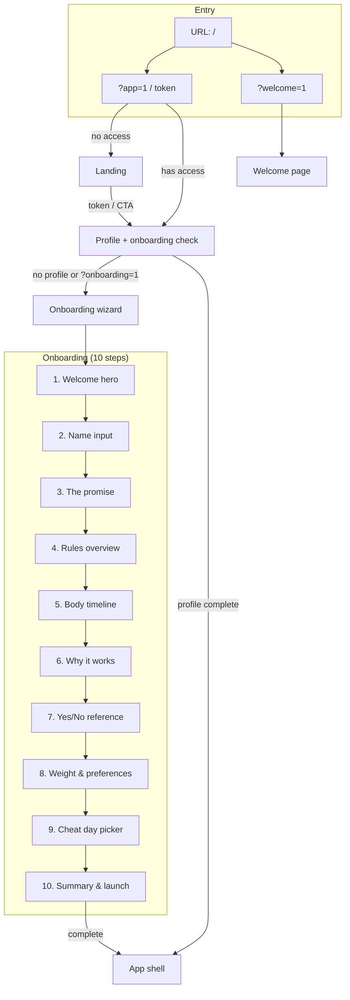
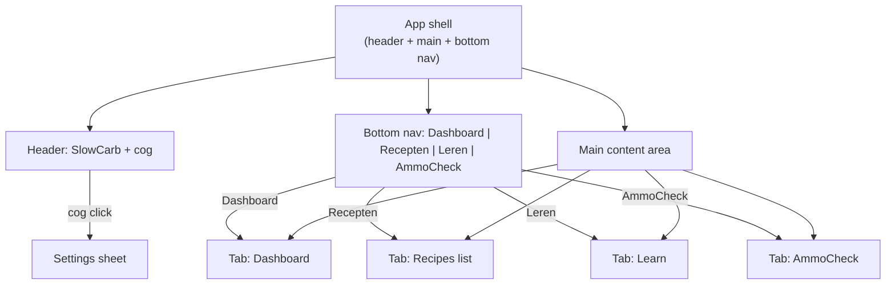
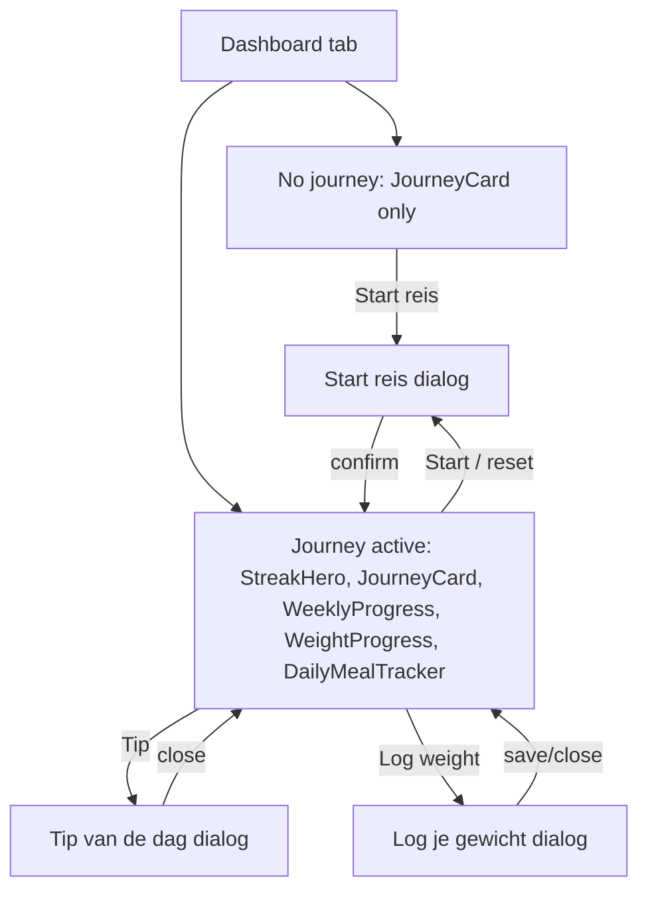
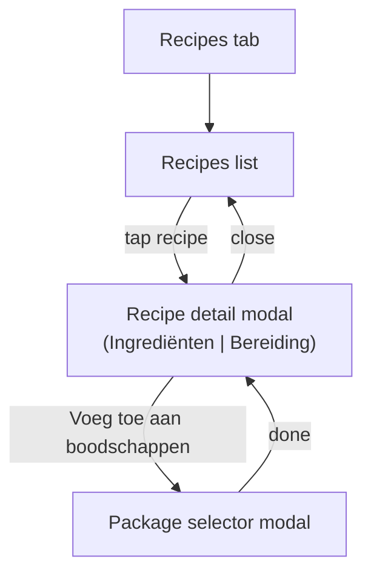
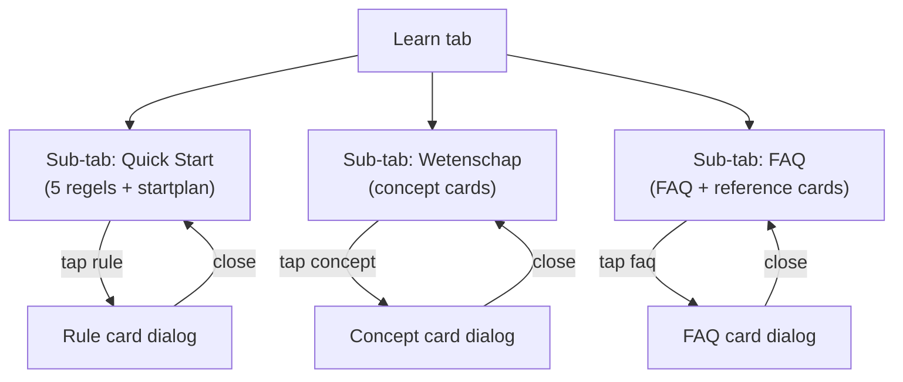
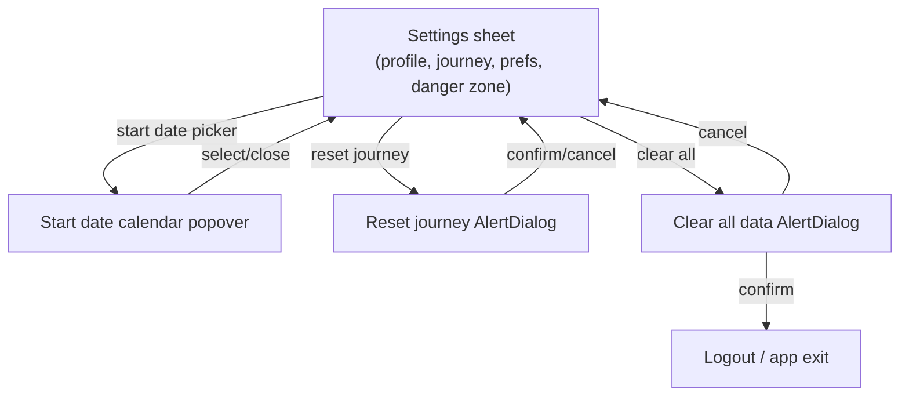
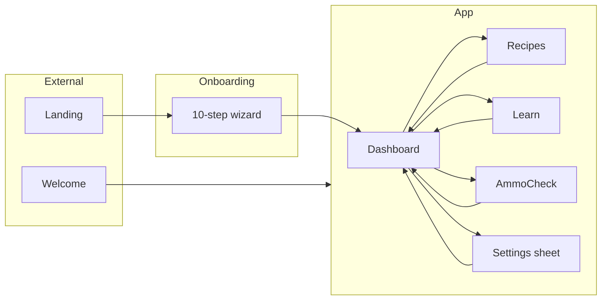

# SlowCarb — Screen flow (wireframes)

Mermaid flow from entry to every tab and overlay. Use with `docs/screen-map.md` for full screen list.

---

## 1. Entry and onboarding

---

## 2. App shell and tabs

---

## 3. Dashboard flow (screens + overlays)

---

## 4. Recipes flow (screens + overlays)

---

## 5. Learn flow (tabs + overlays)

---

## 6. Settings sheet flow (overlays)

---

## 7. Full app overview (simplified)

---

For a flat list of every screen and overlay with "opened from", see **`docs/screen-map.md`**.
